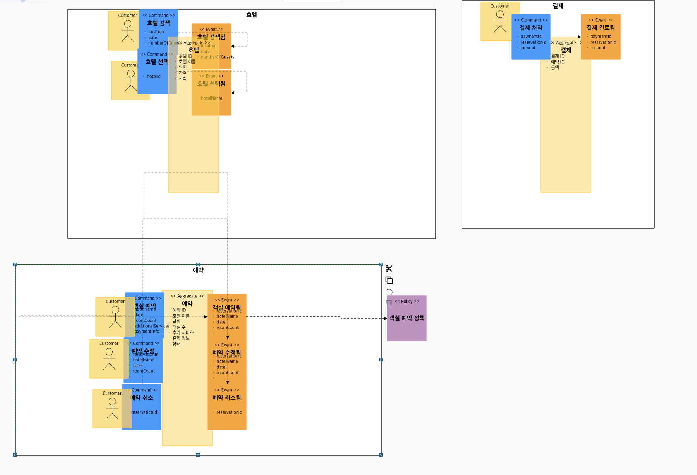

# Hotel Reservation System

[TOC]

------

## 1. 소개

가상면접 사례로 배우는 대규모 시스템 설계 기초 2의 Chapter 7 호텔 예약 시스템을 구현한 예제

## 2. 시나리오

**기능적 요구사항**

1. 호텔 직원이 호텔을 추가 / 갱신 / 삭제한다.
2. 호텔 직원이 객실을 추가 / 갱신 / 삭제한다.
3. 고객은 호텔 상세 정보를 조회한다.
4. 고객은 지정된 날짜 범위에 사용 가능한 객실 유형을 확인한다.
5. 고객이 호텔과 객실을 선택하여 예약한다.
6. 고객은 자신의 예약 이력을 확인한다.
7. 고객은 자신의 예약 이력 중 특정 예약의 상세 정보를 확인한다.
8. 고객은 예약을 취소할 수 있다.

**비기능적 요구사항**

높은 수준의 동시성(concurrency) 지원 : 성수기, 대규모 이벤트 기간에는 일부 인기 호텔의 특정 객실을 예약하려는 고객이 많이 몰릴 수 있다.

1. 트랜잭션

   - 결제가 되지 않은 예약 건은 성립되지 않아야 한다. (Sync 호출)

2. 장애격리

   1. 숙소 등록 및 메시지 전송 기능이 수행되지 않더라도 예약은 365일 24시간 받을 수 있어야 한다 (Async (event-driven), Eventual Consistency)
   2. 예약 시스템이 과중되면 사용자를 잠시동안 받지 않고 잠시 후에 하도록 유도한다 (Circuit breaker, fallback)

3. 성능

   - 모든 방에 대한 정보 및 예약 상태 등을 한번에 확인할 수 있어야 한다 (CQRS)

   - 예약의 상태가 바뀔 때마다 메시지로 알림을 줄 수 있어야 한다 (Event driven)

## 3. 체크포인트

- 분석 설계
  - Eventstorming
    - 스티커 색상별 객체의 의미를 제대로 이해하여 헥사고날 아키텍처와의 연계 설계에 적절히 반영하고 있는가?
    - 각 도메인 이벤트가 의미있는 수준으로 정의되었는가?
    - 애그리거트: Command와 Event 들을 ACID 트랜잭션 단위의 Aggregate 로 제대로 묶었는가?
    - 기능적 요구사항과 비기능적 요구사항을 누락 없이 반영하였는가?
  - Sub Domain, Bounded Context 분리
    - 팀별 KPI 와 관심사, 상이한 배포주기 등에 따른  Sub-domain 이나 Bounded Context 를 적절히 분리하였고 그 분리 기준의 합리성이 충분히 설명되는가?
      - 적어도 3개 이상 서비스 분리
    - 폴리글랏 설계: 각 마이크로 서비스들의 구현 목표와 기능 특성에 따른 각자의 기술 Stack 과 저장소 구조를 다양하게 채택하여 설계하였는가?
    - 서비스 시나리오 중 ACID 트랜잭션이 크리티컬한 Use 케이스에 대하여 무리하게 서비스가 과다하게 조밀히 분리되지 않았는가?
  - Context Mapping / Event Driven Architecture
    - 업무 중요성과 도메인간 서열을 구분할 수 있는가? (Core, Supporting, General Domain)
    - Request-Response 방식과 이벤트 드리븐 방식을 구분하여 설계할 수 있는가?
    - 장애격리: 서포팅 서비스를 제거 하여도 기존 서비스에 영향이 없도록 설계하였는가?
    - 신규 서비스를 추가 하였을때 기존 서비스의 데이터베이스에 영향이 없도록 설계(열려있는 아키택처)할 수 있는가?
    - 이벤트와 폴리시를 연결하기 위한 Correlation-key 연결을 제대로 설계하였는가?
  - 헥사고날 아키텍처
    - 설계 결과에 따른 헥사고날 아키텍처 다이어그램을 제대로 그렸는가?
- 구현
  - [DDD] 분석단계에서의 스티커별 색상과 Hexagonal Architecture에 따라 구현체가 매핑되게 개발되었는가?
    - Entity Pattern 과 Repository Pattern 을 적용하여 JPA 를 통하여 데이터 접근 어댑터를 개발하였는가
    - [헥사고날 아키텍처] REST Inbound adaptor 이외에 gRPC 등의 Inbound Adaptor 를 추가함에 있어서 도메인 모델의 손상을 주지 않고 새로운 프로토콜에 기존 구현체를 적응시킬 수 있는가?
    - 분석단계에서의 유비쿼터스 랭귀지(업무현장에서 쓰는 용어) 를 사용하여 소스코드가 서술되었는가?
  - Request-Response 방식의 Service Oriented Architecture 구현
    - 마이크로 서비스간 Request-Response 호출에 있어 대상 서비스를 어떠한 방식으로 찾아서 호출 하였는가? (Service Discovery, REST, FeignClient)
    - 서킷브레이커를 통하여 장애를 격리시킬 수 있는가?
  - Event Driven Architecture의 구현
    - 카프카를 이용하여 PubSub 으로 하나 이상의 서비스가 연동되었는가?
    - Correlation-key: 각 이벤트 건 (메시지)가 어떠한 Policy를 처리할때 어떤 건에 연결된 처리건인지를 구별하기 위한 Correlation-key 연결을 제대로 구현 하였는가?
    - Message Consumer 마이크로서비스가 장애상황에서 수신받지 못했던 기존 이벤트들을 다시 수신받아 처리하는가?
    - Scaling-out: Message Consumer 마이크로서비스의 Replica 를 추가했을때 중복없이 이벤트를 수신할 수 있는가
    - CQRS: Materialized View 를 구현하여, 타 마이크로서비스의 데이터 원본에 접근없이(Composite 서비스나 조인SQL 등 없이) 도 내 서비스의 화면 구성과 잦은 조회가 가능한가?
  - Polyglot Programming
    - 각 마이크로 서비스들이 하나이상의 각자의 기술 Stack 으로 구성되었는가?
    - 각 마이크로 서비스들이 각자의 저장소 구조를 자율적으로 채택하고 각자의 저장소 유형 (RDB, NoSQL, File System 등)을 선택하여 구현하였는가?
  - API Gateway
    - API GW를 통하여 마이크로 서비스들의 집입점을 통일할 수 있는가?
    - 게이트웨이와 인증서버(OAuth), JWT 토큰 인증을 통하여 마이크로서비스들을 보호할 수 있는가?

## 4. 유즈케이스

### 4.1. Actor

1. 고객 - 호텔 예약을 원하는 개인 또는 그룹
2. 호텔 직원 - 호텔 예약 시스템을 관리하고 고객을 도와주는 호텔 직원
3. 호텔 예약 시스템 - 호텔 예약을 처리하는 시스템

### 4.2. 호텔 검색 및 예약

- 기능: 고객은 호텔을 검색하고 선택하여 예약할 수 있다.

- 시나리오
  1. 고객은 호텔 예약 시스템에 접속한다.
  2. 고객은 원하는 날짜와 지역을 입력하여 호텔을 검색한다.
  3. 시스템은 해당하는 호텔 목록을 보여준다.
  4. 고객은 목록에서 원하는 호텔을 선택한다.
  5. 시스템은 선택한 호텔의 예약 가능한 객실 목록을 보여준다.
  6. 고객은 예약할 객실을 선택하고 예약을 완료한다.
  7. 시스템은 예약 내역을 저장하고 예약 확정 메시지를 보여준다.

```mermaid
---
title : Reservation
---
sequenceDiagram
    autonumber
    actor 고객
    actor 호텔 예약 시스템
    
    고객 ->>+ 호텔 예약 시스템: 검색 요청 (지역, 날짜)
    호텔 예약 시스템 -->- 고객: 호텔 목록 반환
    고객 ->>+ 호텔 예약 시스템: 호텔 선택
    호텔 예약 시스템 -->- 고객: 객실 목록 반환
    고객 -->+ 호텔 예약 시스템: 객실 선택 및 예약 요청
    호텔 예약 시스템 -->- 고객: 예약 확정 메시지 반환
```

### 4.3. 예약 취소

- 기능: 고객은 예약을 취소할 수 있다.
- 시나리오
  1. 고객은 예약을 취소하기 위해 호텔 예약 시스템에 접속한다.
  2. 고객은 예약한 객실의 예약 취소를 요청한다.
  3. 시스템은 예약 취소 요청을 호텔로 전송한다.
  4. 호텔은 예약을 취소하고 취소 완료 메시지를 반환한다.
  5. 시스템은 취소 완료 메시지를 고객에게 보여준다.

```mermaid
---
title : Cacnel
---
sequenceDiagram
    autonumber
    actor 고객
    actor 호텔 예약 시스템
    
    고객 ->>+ 호텔 예약 시스템: 예약 취소 요청
    호텔 예약 시스템 -->- 고객: 취소 완료 메시지 반환
```

### 4.4. Conway의 법칙 관점에서 이 시스템을 관리하는 개발팀과 경계 영역:
1. 호텔 관리 개발팀
  - 담당하는 Bounded Context: 호텔 관리, 요금 관리, 예약 관리
  - 주요 역할: 호텔 정보 관리, 예약 관리, 객실 관리 등 호텔과 관련된 모든 기능 개발과 유지보수
2. 결제 관리 개발팀
  - 담당하는 Bounded Context: 결제 관리
  - 주요 역할: 결제와 관련된 전반적인 기능 개발과 유지보수
3. 고객 관리 개발팀
  - 담당하는 Bounded Context: 고객 관리
  - 주요 역할: 고객 정보 관리, 예약 내역 관리, 결제 관리 등 고객과 관련된 모든 기능 개발과 유지보수

## 5. 이벤트스토밍
